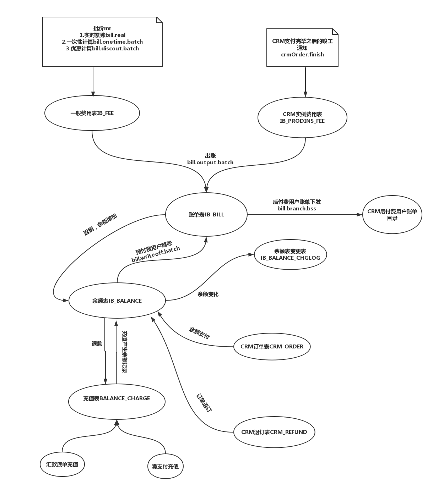
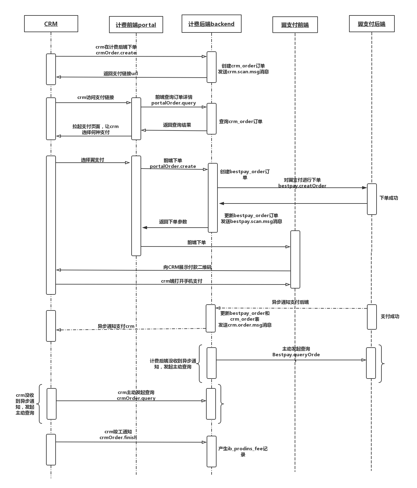
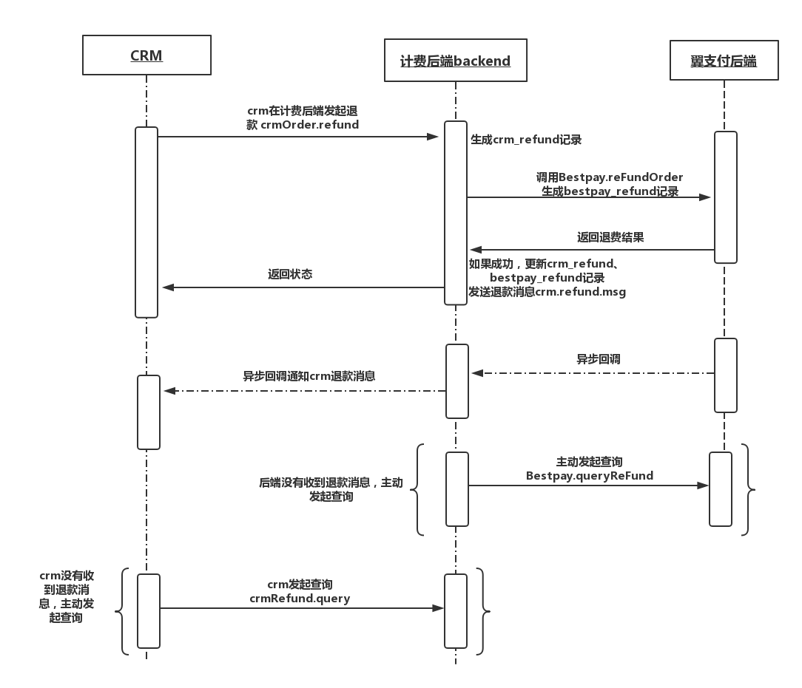

# 1 计费总流程

- 计费总体流程如下图




计量话单过来经过批价产生一般费用`IB_FEE`记录，CRM支付完毕后发送竣工通知产生CRM实例费用`IB_PRODINS_FEE`记录，经过出账步骤，
上面两个表记录按照客户custId、账户acctId、账单科目acctItemId，产品prodId进行账单合并到账单表`IB_BILL`，对账单表中预付费
用户，当余额表有余额时，执行预付费用户销账，余额减少。对于后付费用户，执行账单下发程序，账单下发CRM进行托收。余额表中的记录
来源于充值表，有两种方式，一种是翼支付充值，一种是汇款底单充值。余额表可以用来支付CRM订单，余额减少。发生CRM退订时，余额增加。


# 2 计费最核心的几个表

- 账单表`IB_BILL`

```
CREATE TABLE `ib_bill` (
  `bill_id` bigint(20) NOT NULL COMMENT '自增序列，取自全局序列',
  `acct_id` bigint(20) DEFAULT NULL COMMENT '自增序列，取自全局序列',
  `cust_id` bigint(20) DEFAULT NULL COMMENT '自增序列，取自全局序列',
  `prod_id` bigint(20) NOT NULL COMMENT '产品ID或者是产品类型',
  `bill_type` smallint(6) NOT NULL DEFAULT '0' COMMENT '0 = 普通账单\n            1= crm实例费用账单',
  `acct_Item_id` bigint(20) NOT NULL COMMENT '账目项',
  `bill_cycle_id` int(11) NOT NULL COMMENT '账期',
  `ori_amt` int(11) NOT NULL DEFAULT '0' COMMENT '应收金额（不含税）',
  `tax_amt` int(11) NOT NULL DEFAULT '0' COMMENT '税金',
  `amt` int(11) NOT NULL DEFAULT '0' COMMENT '应收金额，单位：分',
  `paid_amt` int(11) NOT NULL DEFAULT '0' COMMENT '已收金额，单位：分',
  `state` smallint(6) NOT NULL DEFAULT '0' COMMENT '0	未收\n            1	部分收款\n            2	完全收',
  `create_time` datetime DEFAULT NULL,
  `update_time` datetime DEFAULT CURRENT_TIMESTAMP ON UPDATE CURRENT_TIMESTAMP,
  `shard_id` bigint(20) NOT NULL,
  PRIMARY KEY (`bill_id`)
) ENGINE=InnoDB DEFAULT CHARSET=utf8 COMMENT='账单表'
```
注意此表中的`bill_type`字段，这个字段就表示表中记录来源于两部分，一部分是aep内部的计量话单通过实时批价、一次性批
价折扣等过程产生的内部账单，另一部是crm订单实例产生的账单。这两部分记录都是每月初出账的时候，执行出账脚本，调用出
账类`OutputBillManager`,里面两个方法`calcGeneralBill`和`calcCrmProdInsBill`分别和上面两类账单对应


- 余额表`IB_BALANCE` 
   
   余额表中初始金额来源于汇款底单充值`BalanceChargeByVoucher`和翼支付充值`BalanceChargeByBestpay`。

- 余额变更表`IB_BALANCE_CHGLOG`

```
CREATE TABLE `ib_balance_chglog` (
  `chg_log_id` bigint(20) NOT NULL COMMENT '自增序列，取自全局序列',
  `cust_id` bigint(20) NOT NULL COMMENT '客户id,取自增序列',
  `acct_id` bigint(20) NOT NULL COMMENT '自增序列，取自全局序列',
  `balance_id` bigint(20) NOT NULL COMMENT '账本标识',
  `before_amt` bigint(20) NOT NULL DEFAULT '0' COMMENT '变前金额,单位：分',
  `after_amt` bigint(20) NOT NULL DEFAULT '0' COMMENT '变后金额,单位：分',
  `type` smallint(6) NOT NULL COMMENT '0  无状态\n            1 通过IB_BILL 返销\n            2 通过IB_BILL 销账\n            3 通过BALANCE_CHARGE 充值\n            4 通过BALANCE_CHARGE 退款\n            5 通过CRM_ORDER支付\n            6 通过CRM_ORDER退款\n            \n            ',
  `inner_id` bigint(20) NOT NULL COMMENT '与 type 关联的ID',
  `batchId` bigint(20) DEFAULT NULL,
  `oper_code` varchar(16) DEFAULT NULL COMMENT '发起人工号',
  `update_time` datetime NOT NULL DEFAULT CURRENT_TIMESTAMP ON UPDATE CURRENT_TIMESTAMP COMMENT '更新日期',
  `shard_id` bigint(20) NOT NULL,
  PRIMARY KEY (`chg_log_id`)
) ENGINE=InnoDB DEFAULT CHARSET=utf8 COMMENT='余额变更日志'
```

注意此表中的`type`字段。
- 当`type=1`时，表示账单表`IB_BILL`返销，钱重新回到余额表，余额增加，欠账记录恢复。
- 当`type=2`时，表示账单表`IB_BILL`销账，余额表中记录用来销账账单，余额减少，账单销账。
- 当`type=3`时，表示充值表`BALANCE_CHARGE`充值，余额增加。只有这种方式会产生余额记录，其他的都是更新余额记录。充
值有两种方式，一种是通过汇款底单，一种是翼支付
- 当`type=4`时，表示充值表`BALANCE_CHARGE`退款，余额减少。仅支持翼支付的退款，汇款底单退款不支付
- 当`type=5`时，表示CRM订单表`CRM_ORDER`支付订单，余额减少。订单支付成功
- 当`type=6`时，表示CRM订单表`CRM_ORDER`退订订单，余额增加。退订成功


# 3 CRM下单支付流程




计费后端backend和前端portal作为一个对外的支付网关，提供余额支付和第三方支付，目前仅支付翼支付bestpay。
余额支付不涉及第三方对接，仅仅是扣将余额，余额减少。此处不做详细介绍。这里详细介绍下crm选择翼支付支付时，
crm对我们这个支付网关支付流程以及我们对翼支付支付的流程。

1. crm调用后端接口`crmOrder.create`下单，计费后端backend在`crm_order`表中创建订单记录，标记此条记录状态为下单。同时向后台事件服务线程发送过期扫描`crm.scan.msg`事件，当`15分钟`后此订单还没支付，自动关闭此订单。当下单成功后，返回支付链接url。
2. crm访问前端portal提供的支付链接，前端portal调用`portalOrder.query`接口查询订单详情以及是否过期。假若正常，
前端拉起支付页面，让crm选择何种支付方式。本处仅讲解翼支付。
3. 当crm选择翼支付时，前端portal会首先调用后端backend`portalOrder.create`接口进行下单，后端创建针对翼支付的一个
订单表`bestpay_order`记录。然后后端调用`Bestpay`类中的`createOrder`方法对翼支付进行下单，此下单参数中包含回调
参数`notifyUrl`，方便支付成功或者失败后的回调。下单成功后，返回下单结果，后端更新`bestpay_order`表记录，向后台
事件服务线程发送翼支付主动过期扫描`bestpay.scan.msg`事件。并将下单参数返回给前端portal，前端在对翼支付前端发送post请
求，拉起翼支付支付台，生产支付二维码，crm客户打开翼支付客户端进行支付。
4. 当支付成功或者失败后，翼支付对下单接口中的回调地址`notifyUrl`进行调用，后端对调用进行响应，更新翼支付订单表`bestpay_order`记录和crm订单表`crm_order`记录。
并发送`crm.order.msg`事件给后台服务线程，后台服务线程发送消息给crm。
5. 当因为网络问题，后端backend没有收到翼支付异步调用通知，隔`5分钟`后，后端事件服务器会向翼支付发起主动查询。同
样，当crm在一定时间内，没有收到后端backend发送的异步通知，同样会发起主动查询，调用我们的`crmOrder.query`接口。
6. 当crm收到异步支付成功通知后，会进行竣工，当竣工完毕，调用`crmOrder.finish`接口，发送竣工消息。后端backend在
crm订单费费用表`ib_prodIns_fee`中插入记录。

# 4 CRM退款流程


1. crm调用后端退款接口`crmOder.refund`发起退款，后端生产crm在退款表`crm_refund`生产crm退款记录。后端调用
`Bestpay`类中的`reFundOrder`方法向翼支付后端发起退款，并生产翼支付退款表`bestpay_refund`记录。翼支付同步返回退
款结果，如果成功，更新`crm_refund`表和`bestpay_refund`表。
2. 翼支付还有可能会发起异步退款通知，这个可以忽略，以上一步的同步返回结果为准。
3. 如果crm没有收到后端发送的异步退款通知，会调用退款查询接口`crmRefund.query`主动进行查询


# 5 批价、出账、销账MR流程

## 5.1.总流程步骤为：

 1. 先实时累账(`bill.real.xml`)
 2. 一次性费用计算(`bill.onetime.batch.xml`)
 3. 资费套餐计算(`bill.discount.batch.xml`)
 4. 出账(`bill.output.batch.xml`)
 5. 销账（`bill.writeoff.batch.xml`）和下发(`bill.branch.bss.xml`)

 每个步骤mr工作目录都类似，比如

 * 实时累账目录为`${vfs.homoe}=${vfs.root}/${vfs.working}/bill/real`
 * 一次性计算目录为`${vfs.homoe}=${vfs.root}/${vfs.working}/bill/oneTime`
 * 优惠计算目录为`${vfs.homoe}=${vfs.root}/${vfs.working}/bill/discount`
 * 出账费用计算目录为 `${vfs.homoe}=${vfs.root}/${vfs.working}/bill/output`
 * 销账计算目录为 `${vfs.homoe}=${vfs.root}/${vfs.working}/bill/writeoff`
 `${vfs.root}/${vfs.working}`这两个变量配置在工程的setting.xml文件中。其中`${vfs.root}=/apps` `${vfs.working}=alogic/aepdata/data`。

## 5.2 详细流程

1. 首先实时累账（`bill.real.xml`).每5分钟执行一次，脚本先从晓云的的计量目录下
`/apps/alogic/aepdata/data/mergebill`。 将计量文件移到实时累账的输入目录`${vfs.home}/${day}/${$task}/in`
再利用`check-file`插件检查清单是否存在清单查重表`JF_DETAIL_REPEAT`中，如果已经存在，则将此文件移到
`${vfs.home}/${day}/${$task}/hup`目录下面。然后在开始启动mr。先从实例表`PROD_INST`中找订购信息，从套餐资费
表`PM_PROD_TARIFF`中找资费(使用量资费或者阶梯计费，这两个套餐互斥），将实时累积量插入到累积量表`JF_COUNTER`。按
照套餐中资费批价，将批价值写入计费表`IB_FEE`中`real_amt`字段.批价出来话单放`${vfs.home}/${day}/${$task}/out`
2. 然后是月初一次性费计算（`bill.onetime.batch.xml`）.同样是先从实例表`PROD_INST`中找订购信息，在从套餐资费表`PM_PROD_TARIFF`中找一次性费用套餐，计算出来的值放入到计费表`IB_FEE`中`onetime_amt`。
3. 接着是月初的资费优惠计算（`bill.discount.batch.xml`). 同样是先从实例表`PROD_INST`中找订购信息，在从套餐
资费表`PM_PROD_TARIFF`中找优惠资费，在找优惠资费表`PM_DISCOUNT_TARIFF`，优惠有两种类型,一种是
`discount_type=1`，打折优惠，对`IB_FEE`中`real_amt`和`onetime_amt`累加值进行优惠。将优惠值填入`discount_amt`字段。`discount_type=2`，扣减优惠，同样对`IB_FEE`中`real_amt`和`onetime_amt`累加值进行优惠,将优惠值填入`discount_amt`字段,`discount_amt`为负值。
4. 接着是月初的出账(`bill.output.batch.xml`)。出账有两部分，一是上述流程产生的`IB_FEE`中记录到账单表
`IB_BILL`。二是，crm订单竣工产生的`IB_PRODINS_FEE`的crm订单费用。第一部分是将`IB_FEE`中的`real_amt`,`onetime_amt`,`discount_amt`三个字段相加 ，按照客户custId、账户acctId、账单科目acctItemId，产品prodId进行合
并，并查找账单科目表`IB_ACCT_TYPE`中的税
率，将计算出来的值插入到账单表`IB_BILL`。第二部分是根据crm订购实例的生失效时期计算本订购记录在本账期产生的费用
，同时根据`IB_ACCT_TYPE_PROD`中查找订购类型prod_type关联的账目和税率，计算出来值同样插入到账单表中`IB_BILL`。
5. 对于上一步产生的账单，从用户付费的角度来说，有两种话单，一种预付费，一种是后付费。执行月初的批量销账
(`bill.writeoff.batch.xml`)脚本，对预付费账单记录进行销账，余额减少，账单状态更新。执行月初的账单下发(`bill.branch.bss.xml`)脚本，对后付费账单记录下发到crm指定的HDFS目录，由CRM进行销账。

## 5.3 联调环境如何测试：

1. 登录132.246.27.76联调机子，cd 到/home/alogic/ngbilling/lib 目录
2. 执行`../bin/ng-billing-cmd.sh event=bill.real`脚本，看下清单查重表`JF_DETAIL_REPEAT`是否有相应的文件。
看下积量表`JF_COUNTER`中是否生成数据，其中`counter_type=1`是按照消息，`counter_type=2`是按照次数。
去订购实例`prod_inst`中找租户的订购信息，再到资费套餐表`pm_prod_tariff`中找使用量资费或者阶梯资费，当资费表中的
`meter_type`和清单记录中一样时，才可以进行批价。
3. 接着执行脚本`../bin/ng-billing-cmd.sh event=bill.onetime.batch` 执行一次性资费计算。
4. 然后是执行`../bin/ng-billing-cmd.sh event=bill.dicount.batch` 。执行优惠计算。逻辑是根据订购实例找到优
惠资费表`pm_discount_tariff`，对费用表`IB_FEE`进行优惠
5. 最后执行`../bin/ng-billing-cmd.sh event=bill.output.batch` 。执行出账，对`IB_FEE`中数据按照custId,acctId,acctItemId,billCycleId,prodId进行累账
6. 销账执行`../bin/ng-billing-cmd.sh event=bill.writeoff.batch`. 先遍历账户表`cm_ca_account`，对每个账户进行销账，发现余额表`ib_balance`该账户有余额时，就对他进行销账，余额减少并将相关记录写到余额变更表`ib_balance_chglog`中。
7. 外部收费账单下发`../bin/ng-billing-cmd.sh event=bill.branch.bss`。先扫描客户表，捞出
`channel='crm'`外部收费客户。执行mr,到账单表`IB_BILL`捞取状态还未收的外部客户的账单，按照指定的格式生成二进制格式的账单文件和账单稽核文件。下放BSS收费目录为`/apps/alogic/aepdata/data/billtoiot`

# 6 注意的事情

## 6.1 预付费用户和后付费用户

预付费用户是AEP内部进行收费，后付费用户CRM进行托收。在CRM订单支付的时候，当为预付费用户时，没有余额或者没翼支付支付，订单不算支付成功，当为后付费用户的时候，可以不支付也可以进行竣工。生产的账单会下发到CRM，让CRM进行托收。

## 6.2 后台事件服务线程

对于一些非强事务一致性的操作，放到后台事件服务线程异步执行。目前有以下消息
- `crm.refund.msg` 退款异步消息
- `crm.order.msg` 支付异步消息
- `crm.scan.msg` 扫描crm订单过期消息
- `bestpay.scan.msg` 扫描翼支付订单过期消息
- `writeoff.msg` 汇款底单充值确认引起的销账消息